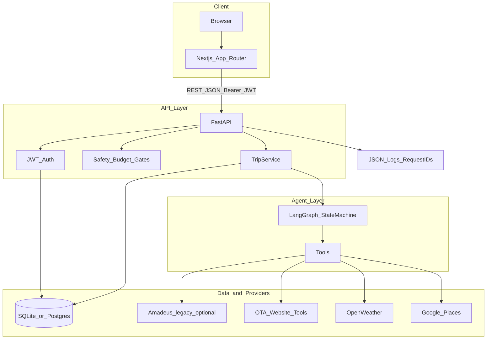
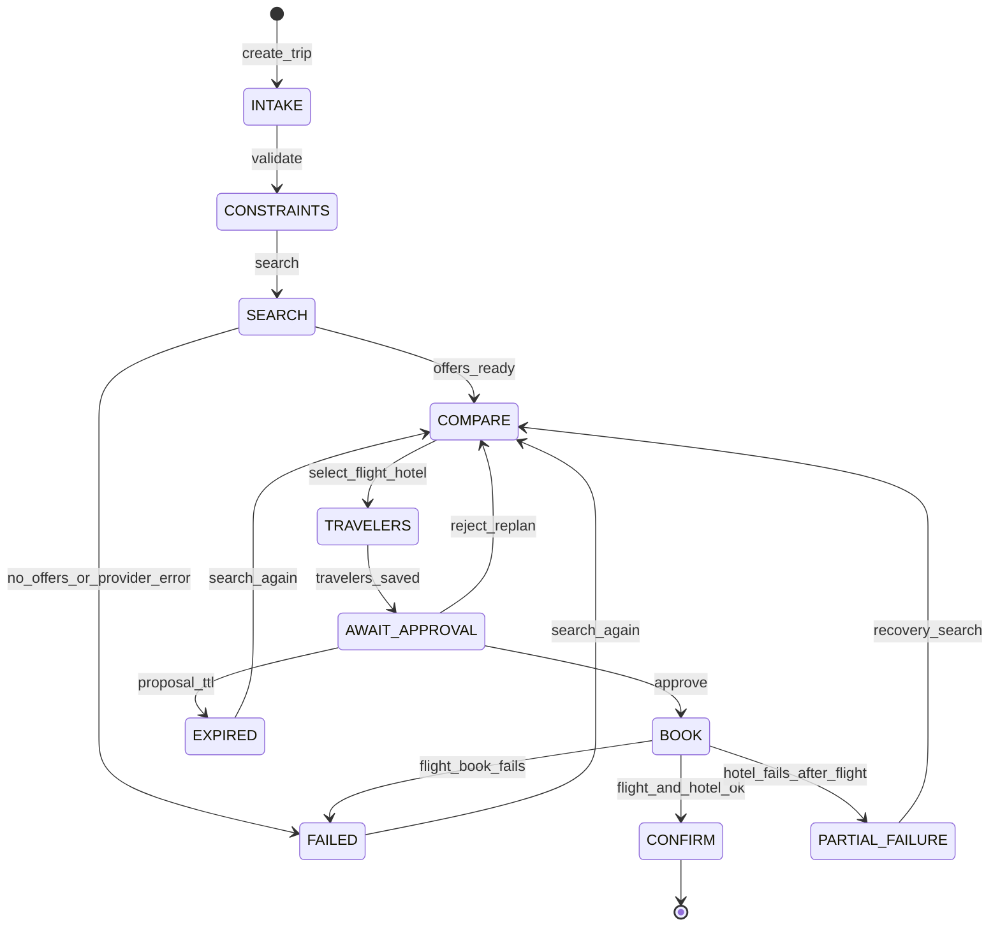
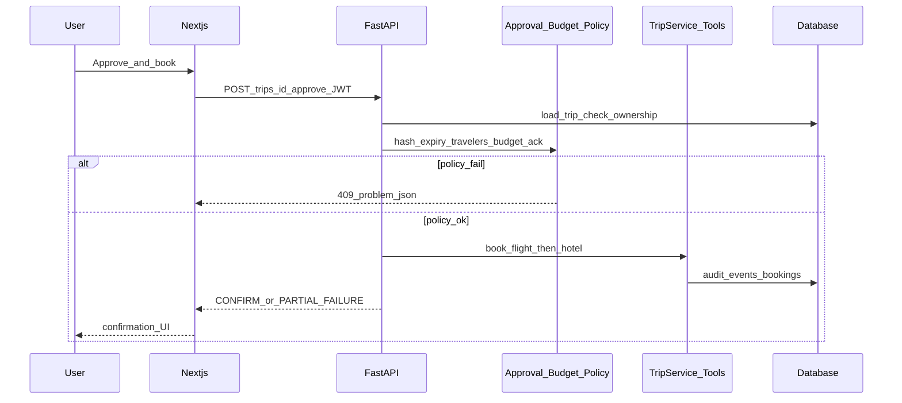

# Travel Booking Agent

Production travel booking platform: **Next.js** product UI + **FastAPI** API + a **single LangGraph** booking agent.

This is not a chatbot. Users search with structured fields, compare flights and hotels, enter travelers, then **approve before anything is booked**.

```text
Signup / Login
    → Dashboard
    → Search (IATA, dates, adults, budget)
    → Compare offers (select flight + hotel)
    → Travelers
    → Review & Approve
    → Book → Confirm
```

---

## System diagram

### Architecture



### Booking state machine



### Request path for approve and book



---

## Stack

| Layer | Choice |
|-------|--------|
| Web | Next.js 15 (App Router) + TypeScript |
| API | FastAPI + Pydantic |
| Agent | One LangGraph state machine + tools |
| Auth | JWT (access + refresh), bcrypt passwords |
| DB | SQLite locally; Postgres-ready via `DATABASE_URL` |
| Providers | Multi-website flight/hotel search (Google Flights, Kayak, Expedia, Booking.com, Hotels.com, airline direct — mock by default via `FLIGHT_SOURCES=mock`), OpenWeather, Google Places |

---

## Why not 8 agents?

An earlier proposal suggested Flight, Hotel, Budget, Weather, Review, Negotiation, Safety, and Supervisor agents. That is premature multi-agent.

| Proposed “agent” | Correct form |
|------------------|--------------|
| Flight / Hotel | Tools (`search_*`, `book_*`) |
| Weather / Review | Read-only tools |
| Budget | Deterministic filter + scorer |
| Safety | Input / action / output guardrails |
| Negotiation | Out of scope for v1 |
| Supervisor | Unnecessary — one agent + state machine |

---

## Project layout

```text
.
├── src/travel_agent/          # FastAPI + agent backend
│   ├── api/                   # Routes, CORS, request IDs
│   ├── auth.py                # Signup/login/JWT
│   ├── agent/                 # LangGraph graph + prompts
│   ├── tools/                 # Amadeus, weather, reviews
│   ├── policies/              # Budget, approval hash, safety
│   ├── models/                # Pydantic schemas
│   ├── db/                    # SQLAlchemy + audit log
│   └── observability/         # JSON logs, cost/step limits
├── web/                       # Next.js UI
│   ├── app/                   # Landing, auth, dashboard, trips
│   ├── lib/api.ts             # Typed API client
│   └── e2e/                   # Playwright smoke
├── tests/                     # Unit + integration
├── .env.example
└── pyproject.toml
```

---

## Prerequisites

- Python **3.9+**
- Node.js **18+** (20/22 recommended)
- Optional: Amadeus / OpenWeather / Google Places API keys for live data

---

## Quick start

### 1. Backend API (`:8000`)

```bash
cd "Travel Booking Agent"
python3 -m venv .venv
source .venv/bin/activate          # Windows: .venv\Scripts\activate
pip install -e ".[dev]"
cp .env.example .env

# If you previously ran the MVP schema, remove the old DB once:
# rm -f travel_agent.db

uvicorn travel_agent.api.main:app --reload --app-dir src --host 127.0.0.1 --port 8000
```

- Health: http://127.0.0.1:8000/health  
- OpenAPI docs: http://127.0.0.1:8000/docs  

### 2. Web UI (`:3000`)

```bash
cd web
npm install
# optional: echo 'NEXT_PUBLIC_API_URL=http://127.0.0.1:8000' > .env.local
npm run dev
```

Open **http://localhost:3000** → create an account → **New trip**.

---

## Configuration

Copy `.env.example` → `.env`. Important variables:

| Variable | Purpose | Default |
|----------|---------|---------|
| `DATABASE_URL` | SQLAlchemy URL | `sqlite:///./travel_agent.db` |
| `JWT_SECRET` | Sign access/refresh tokens | change in production |
| `CORS_ORIGINS` | Allowed Next origins | `http://localhost:3000,...` |
| `PROPOSAL_TTL_MINUTES` | Proposal expiry before approve | `30` |
| `AMADEUS_MOCK` | Legacy Amadeus client (not used for default search) | `true` |
| `FLIGHT_SOURCES` | `mock` (multi-site demo adapters) or `live` (experimental hooks) | `mock` |
| `KILL_SWITCH` | Disable new searches | `false` |
| `OPENAI_API_KEY` | Optional LLM extraction | empty (heuristics used) |

Web:

| Variable | Purpose |
|----------|---------|
| `NEXT_PUBLIC_API_URL` | FastAPI base URL (`http://127.0.0.1:8000`) |

### Multi-website search (default)

Trip search runs **one booking agent** with many website tools in parallel (`search_google_flights`, `search_kayak`, `search_expedia`, hotel site tools, etc.). Results are merged, deduped, and ranked; each tool call appears in the trip **Agent tool calls** panel. Set `FLIGHT_SOURCES=mock` for realistic demo data labeled by source website.

### Legacy Amadeus sandbox (optional)

1. Create an app at [Amadeus for Developers](https://developers.amadeus.com/)
2. In `.env`:

```env
AMADEUS_MOCK=false
AMADEUS_CLIENT_ID=...
AMADEUS_CLIENT_SECRET=...
AMADEUS_HOSTNAME=test
```

---

## Product flow (UI)

1. **Search** — airport autocomplete (city/name → IATA), dates, adults, optional budget & preferences  
2. **Compare** — selectable flight and hotel lists (over-budget combinations flagged)  
3. **Travelers** — one form per adult; count must match  
4. **Review & approve** — price breakdown, weather/reviews, expiry countdown; over-budget requires explicit ack  
5. **Confirm** — booking references (PNRs / mock refs)

---

## API overview

All trip routes require `Authorization: Bearer <access_token>`.

### Auth

| Method | Path | Description |
|--------|------|-------------|
| `POST` | `/auth/signup` | Create account → tokens |
| `POST` | `/auth/login` | Login → tokens |
| `POST` | `/auth/refresh` | Refresh access token |
| `GET` | `/auth/me` | Current user |

### Trips

| Method | Path | Description |
|--------|------|-------------|
| `GET` | `/trips` | List current user’s trips |
| `POST` | `/trips` | Create trip from structured constraints |
| `GET` | `/trips/{id}` | Trip detail (404 if not owned) |
| `POST` | `/trips/{id}/search` | Search → `COMPARE` |
| `POST` | `/trips/{id}/select` | Select flight + hotel → proposal |
| `PUT` | `/trips/{id}/travelers` | Save travelers |
| `POST` | `/trips/{id}/approve` | HITL book |
| `POST` | `/trips/{id}/reject` | Reject → re-search |

Errors use RFC7807-style `application/problem+json` (`type`, `title`, `status`, `detail`, `code`, `retryable`, `request_id`).

---

## Safety & edge cases

| Case | Behavior |
|------|----------|
| Unauthenticated | `401` |
| Other user’s trip | `404` (no existence leak) |
| Bad IATA / dates / traveler count | `422` |
| Over budget without ack | `409` `over_budget_ack_required` |
| Stale / wrong itinerary hash | `409` |
| Proposal past TTL | `EXPIRED` |
| Hotel fails after flight books | `PARTIAL_FAILURE` |
| Kill switch on | `503` on new searches |

Booking tools require a valid **approval id** + **itinerary hash**. Side effects are audited.

---

## Tests

```bash
# Backend
source .venv/bin/activate
export PYTHONPATH=src
pytest tests/unit tests/integration -q

# Frontend e2e (API on :8000 and web on :3000 must be running)
cd web
npx playwright install chromium
npm run test:e2e
```

---

## Design notes

- Brand **Travel Booking Agent** is the hero on the landing page (not a chat box).
- App shell after login is trip-focused with a clear step indicator.
- Typography: Fraunces + Source Sans 3; coastal teal palette.
- Motion: step transitions + offer selection feedback.

---

## License

Private project — all rights reserved unless otherwise stated.
